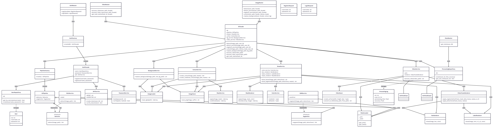

# AI-object-detection

> Веб-застосунок для автоматизованого виділення та редагування об'єктів на медіафайлах із використанням моделей комп'ютерного зору YOLOv8 та SAM 2.

---

## Автор

- **ПІБ**: Гусак Марія
- **Група**: ФЕП-42
- **Керівник**: Жишкович Андрій Володимирович, асистент
- **Дата виконання**: 24.05.2026

---

## Загальна інформація

- **Тип проєкту**: Веб-застосунок
- **Мови програмування**: Python, TypeScript
- **Backend**: FastAPI, SQLAlchemy, Celery
- **Frontend**: Next.js (React), Tailwind CSS
- **AI моделі**: YOLOv8 (Ultralytics), SAM 2 (Meta AI)
- **Бази даних**: PostgreSQL, Redis
- **Розгортання**: Docker, Docker Compose

---

## Опис функціоналу

- Реєстрація та авторизація користувачів (JWT)
- Детекція об'єктів на зображеннях (YOLOv8)
- Сегментація об'єктів із піксельною точністю (SAM 2)
- Вирізання об'єктів із прозорим фоном (single / multi / combined)
- Заміна фону на зображеннях
- Синхронна та асинхронна обробка відео (Celery + Redis)
- Dashboard із персональною статистикою користувача
- Повна контейнеризація засобами Docker Compose

---

## Опис основних класів / файлів

| Клас / Файл | Призначення |
|-------------|-------------|
| `app/facades/ai_facade.py` | Центральний координатор AI-обробки (патерн Facade) |
| `app/facades/auth_facade.py` | Координатор автентифікації (патерн Facade) |
| `app/factories/pipeline_factory.py` | Створення AI-конвеєра YOLOv8 + SAM 2 (патерн Factory) |
| `app/factories/auth_factory.py` | Створення AuthFacade із залежностями (патерн Factory) |
| `app/services/yolo_service.py` | Детекція об'єктів через YOLOv8 |
| `app/services/sam_service.py` | Сегментація об'єктів через SAM 2 |
| `app/services/draw_service.py` | Візуалізація результатів (bounding boxes, маски) |
| `app/services/cutout_service.py` | Вирізання об'єктів із прозорим фоном |
| `app/services/background_service.py` | Заміна фону |
| `app/services/video_service.py` | Покадрова обробка відео |
| `app/domain/pipeline.py` | Доменний об'єкт AIPipeline (detector + segmenter) |
| `app/domain/protocols.py` | Протоколи Detector та Segmenter |
| `app/core/model_loader.py` | Централізоване завантаження моделей (Singleton) |
| `app/workers/celery_tasks.py` | Асинхронна задача обробки відео |
| `app/repositories/processing_repository.py` | Збереження та отримання статистики |
| `app/repositories/user_repository.py` | Робота з користувачами в БД |
| `app/api/image.py` | REST API ендпоінти обробки зображень |
| `app/api/video.py` | REST API ендпоінти обробки відео |
| `app/api/auth.py` | REST API реєстрації та авторизації |
| `app/api/stats_router.py` | REST API статистики користувача |
| `src/app/image/page.tsx` | Сторінка обробки зображень (Next.js) |
| `src/app/video/page.tsx` | Сторінка обробки відео (Next.js) |
| `src/app/dashboard/page.tsx` | Dashboard зі статистикою (Next.js) |

---

## Діаграма класів




---

## Як запустити проєкт "з нуля"

### 1. Встановлення інструментів

- Docker
- Docker Compose
- Git

### 2. Клонування репозиторію

```bash
git clone https://github.com/your-user/ai-object-detection.git
cd ai-object-detection
```

### 3. Створення `.env` файлу

Створи файл `backend/.env` на основі прикладу:

```env
POSTGRES_USER=your_postgresuser
POSTGRES_PASSWORD=your_postgrespassword
POSTGRES_DB=your_db
DATABASE_URL=your_databaseurl
REDIS_BROKER_URL=your_redisbrokerurl
REDIS_BACKEND_URL=your_backendurl
SECRET_KEY=your_supersecretkey
```

### 4. Завантаження ваг моделей

Завантаж ваги YOLOv8 та SAM 2 і розмісти їх у директорії `backend/models/`

### 5. Запуск через Docker Compose

```bash
docker-compose up --build
```

Після успішного запуску:

| Сервіс | Адреса |
|--------|--------|
| Frontend (Next.js) | http://localhost:3000 |
| Backend API (FastAPI) | http://localhost:8000 |
| Swagger документація | http://localhost:8000/docs |
| PostgreSQL | localhost:5432 |
| Redis | localhost:6379 |

### 6. Ініціалізація бази даних

Після першого запуску виконай міграції:

```bash
docker exec ai_backend alembic upgrade head
```

---

## Структура проєкту

```
AI-object-detection/
├── backend/
│   ├── app/
│   │   ├── api/              # FastAPI роутери
│   │   ├── auth/             # JWT автентифікація
│   │   ├── business_logic/   # Операції над зображеннями
│   │   ├── core/             # Конфігурація, БД, завантаження моделей
│   │   ├── domain/           # Доменні об'єкти та протоколи
│   │   ├── facades/          # Фасади (патерн Facade)
│   │   ├── factories/        # Фабрики (патерн Factory)
│   │   ├── models/           # SQLAlchemy моделі
│   │   ├── repositories/     # Доступ до бази даних
│   │   ├── services/         # AI та прикладні сервіси
│   │   ├── utils/            # Валідація та збереження файлів
│   │   └── workers/          # Celery задачі
│   ├── alembic/              # Міграції бази даних
│   ├── models/               # Ваги AI моделей
│   ├── Dockerfile
│   └── requirements.txt
├── frontend/
│   ├── src/
│   │   ├── app/              # Next.js сторінки (App Router)
│   │   ├── components/       # Перевикористовувані компоненти
│   │   ├── lib/              # Допоміжні функції для API
│   │   └── store/            # Глобальний стан (JWT токен)
│   ├── Dockerfile
│   └── package.json
├── docker-compose.yml
└── README.md
```

---

## API Ендпоінти

| Метод | Ендпоінт | Опис |
|-------|----------|------|
| `POST` | `/auth/register` | Реєстрація користувача |
| `POST` | `/auth/login` | Авторизація, отримання JWT |
| `POST` | `/image/detect` | Детекція об'єктів |
| `POST` | `/image/detect-preview` | Детекція з візуалізацією |
| `POST` | `/image/segment-preview` | Сегментація з візуалізацією |
| `POST` | `/image/cutout` | Вирізання об'єктів |
| `POST` | `/image/replace-background` | Заміна фону |
| `POST` | `/video/process` | Синхронна обробка відео |
| `POST` | `/video/process-async` | Асинхронна обробка відео |
| `GET` | `/video/status/{task_id}` | Статус асинхронної задачі |
| `GET` | `/stats/` | Статистика користувача |

---

## Використані технології

| Технологія | Версія | Призначення |
|------------|--------|-------------|
| Python | 3.11 | Мова серверної частини |
| FastAPI | latest | Web-фреймворк |
| SQLAlchemy | latest | ORM для PostgreSQL |
| Celery | latest | Асинхронні задачі |
| Next.js | 14+ | Frontend фреймворк |
| TypeScript | 5+ | Типізація frontend |
| YOLOv8 | 8.x | Детекція об'єктів |
| SAM 2 | 2.1 | Сегментація об'єктів |
| PostgreSQL | 16 | Реляційна БД |
| Redis | 7 | Брокер повідомлень |
| Docker | 24+ | Контейнеризація |
